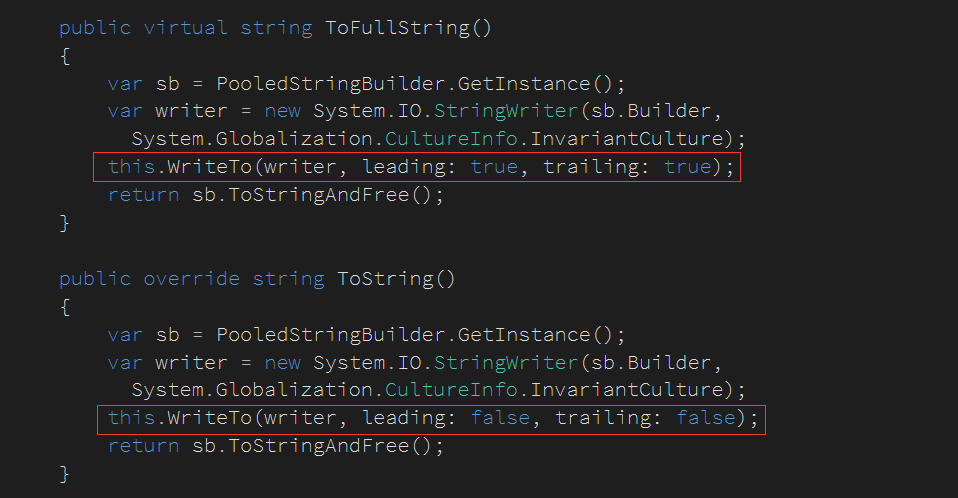

本文告诉大家经常使用的 NameSyntax 拿到值的 ToString 和 ToFullString 方法的区别

<!--more-->

<!-- 标签：Roslyn,MSBuild,编译器 -->

从代码可以看到 NameSyntax 的 ToString 和 ToFullString 方法是调用 Green 的 ToString 和 ToFullString ，所以具体还需要进入 Green 看是如何写

<!--  -->

这里 NameSyntax 的 Green 是 GreenNode ，从 代码可以看到两个方法的区别

<!--  -->

使用 ToFullString 会添加前后的空白代码，使用 ToString 的就会去掉前后空白代码，如获取 `using lindexi.wpf.Framework` 的代码，使用两个不同的函数可以获得不同的值

<!--  -->

<!--  -->

除了空白，使用 ToFullString 可以拿到换行，如获得类的基类，使用 `TypeSyntax` 拿到的可能包含换行。

如类型 `class lindexi : doubi` ，使用两个不同的函数可以看到不同的变量

<!--  -->

<!--  -->

所以 ToFullString 拿到的变量使用 Trim 就是 ToString 拿到的变量

如果好奇本文开始说的  Green 是什么，请看 [理解 Roslyn 中的红绿树（Red-Green Trees） - walterlv](https://walterlv.github.io/post/the-red-green-tree-of-roslyn.html )

