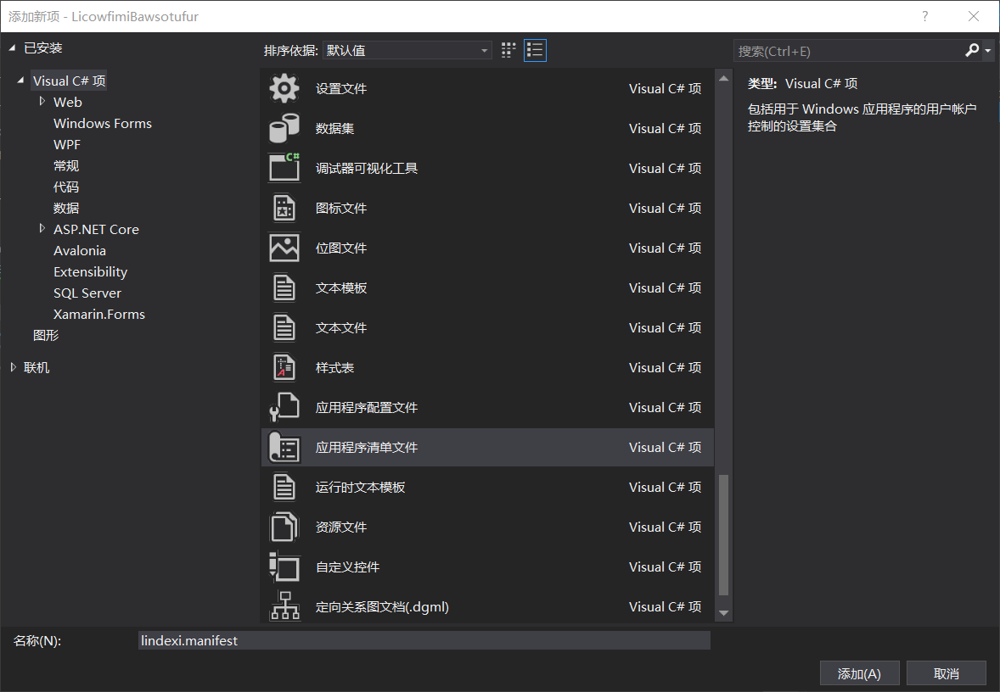

本文告诉大家如何在 C# 控制台项目使用 UAC 权限。这个方法在 WPF 和 控制台都是可以使用。

<!--more-->


<!-- csdn -->

<!-- 标签：C#，控制台，WPF -->

右击项目，点击添加文件，找到程序清单

<!--  -->


在 WPF 使用 UAC 也是一样的方法。

打开这个创建的文件，可以看到下面代码

```csharp
 忽略其他代码
 <requestedExecutionLevel level="asInvoker" uiAccess="false" />
```

只需要把这个代码修改为

```csharp
        <requestedExecutionLevel level="requireAdministrator" uiAccess="false" />

```

就可以在程序使用 UAC 权限，文件的名字可以是随意，全部代码请看下面

```xml
<?xml version="1.0" encoding="utf-8"?>
<assembly manifestVersion="1.0" xmlns="urn:schemas-microsoft-com:asm.v1">
  <assemblyIdentity version="1.0.0.0" name="MyApplication.app"/>
  <trustInfo xmlns="urn:schemas-microsoft-com:asm.v2">
    <security>
      <requestedPrivileges xmlns="urn:schemas-microsoft-com:asm.v3">
        <!-- UAC 清单选项
             如果想要更改 Windows 用户帐户控制级别，请使用
             以下节点之一替换 requestedExecutionLevel 节点。n
        <requestedExecutionLevel  level="asInvoker" uiAccess="false" />
        <requestedExecutionLevel  level="requireAdministrator" uiAccess="false" />
        <requestedExecutionLevel  level="highestAvailable" uiAccess="false" />

            指定 requestedExecutionLevel 元素将禁用文件和注册表虚拟化。
            如果你的应用程序需要此虚拟化来实现向后兼容性，则删除此
            元素。
        -->
        <requestedExecutionLevel level="requireAdministrator" uiAccess="false" />
      </requestedPrivileges>
    </security>
  </trustInfo>

  <compatibility xmlns="urn:schemas-microsoft-com:compatibility.v1">
    <application>
      <!-- 设计此应用程序与其一起工作且已针对此应用程序进行测试的
           Windows 版本的列表。取消评论适当的元素，Windows 将
           自动选择最兼容的环境。 -->

      <!-- Windows Vista -->
      <!--<supportedOS Id="{e2011457-1546-43c5-a5fe-008deee3d3f0}" />-->

      <!-- Windows 7 -->
      <!--<supportedOS Id="{35138b9a-5d96-4fbd-8e2d-a2440225f93a}" />-->

      <!-- Windows 8 -->
      <!--<supportedOS Id="{4a2f28e3-53b9-4441-ba9c-d69d4a4a6e38}" />-->

      <!-- Windows 8.1 -->
      <!--<supportedOS Id="{1f676c76-80e1-4239-95bb-83d0f6d0da78}" />-->

      <!-- Windows 10 -->
      <!--<supportedOS Id="{8e0f7a12-bfb3-4fe8-b9a5-48fd50a15a9a}" />-->

    </application>
  </compatibility>

  <!-- 指示该应用程序可以感知 DPI 且 Windows 在 DPI 较高时将不会对其进行
       自动缩放。Windows Presentation Foundation (WPF)应用程序自动感知 DPI，无需
       选择加入。选择加入此设置的 Windows 窗体应用程序(目标设定为 .NET Framework 4.6 )还应
       在其 app.config 中将 "EnableWindowsFormsHighDpiAutoResizing" 设置设置为 "true"。-->
  <!--
  <application xmlns="urn:schemas-microsoft-com:asm.v3">
    <windowsSettings>
      <dpiAware xmlns="http://schemas.microsoft.com/SMI/2005/WindowsSettings">true</dpiAware>
    </windowsSettings>
  </application>
  -->

  <!-- 启用 Windows 公共控件和对话框的主题(Windows XP 和更高版本) -->
  <!--
  <dependency>
    <dependentAssembly>
      <assemblyIdentity
          type="win32"
          name="Microsoft.Windows.Common-Controls"
          version="6.0.0.0"
          processorArchitecture="*"
          publicKeyToken="6595b64144ccf1df"
          language="*"
        />
    </dependentAssembly>
  </dependency>
  -->

</assembly>

```

关于 uiAccess 请看[让 Windows 桌面程序运行在 Windows 应用上面](https://walterlv.github.io/wpf/2015/03/31/run-desktop-application-above-windows-application.html )

