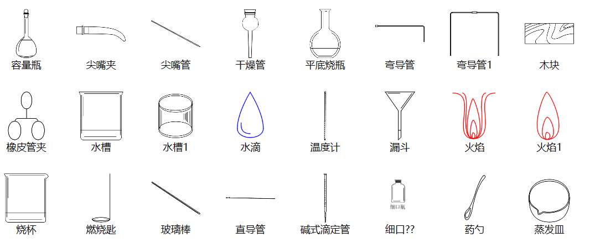

本文告诉大家如何在 ListView 或 ListBox 使用 WrapPanel 让里面的控件自动换行

<!--more-->


<!-- csdn -->

在 WPF 可以通过修改 ItemsPanel 设置使用不同的 ItemsPanel 如 StackPanel 等

可以通过使用 WrapPanel 让控件，如果宽度在 ListView 或 ListBox 之外就换行

```csharp
            <ListView.ItemsPanel>
                <ItemsPanelTemplate>
                    <WrapPanel Orientation="Horizontal"></WrapPanel>
                </ItemsPanelTemplate>
            </ListView.ItemsPanel>
```

如果现在就运行代码，看到所有的控件都放在水平，没有在 ListView 自动换行

因为没有设置 ListView 不能水平移动，在 ListView 的宽度是无限，设置 ListView 的框架就是他的可见宽度可以使用下面代码

```csharp
ScrollViewer.HorizontalScrollBarVisibility="Disabled"
```

现在的 ListView 看起来大概是下面代码

```csharp
<ListView ScrollViewer.HorizontalScrollBarVisibility="Disabled">
  <ListView.ItemsPanel>
    <ItemsPanelTemplate>
      <WrapPanel Orientation="Horizontal" />
    </ItemsPanelTemplate>
  </ListView.ItemsPanel>
  ...
</ListView>
```

<!--  -->


[win10 UWP ListView](https://lindexi.gitee.io/post/win10-UWP-ListView.html)

